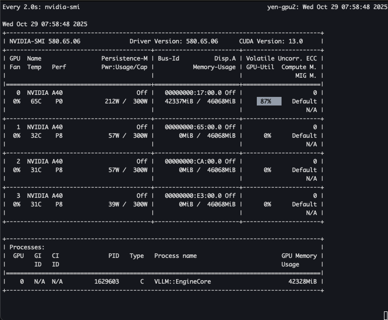
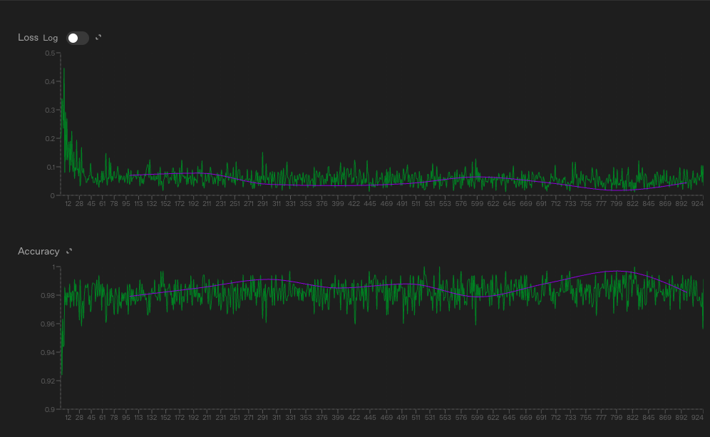

# vllm_helper

Helper scripts and examples for running **vLLM** on Stanford clusters (Sherlock, Marlowe, Yens) and for evaluating **fine-tuned LoRA adapters** trained on [Together](https://together.ai).

This repo accompanies the blog post [Fine-Tuning Open Source Models with Together + vLLM](link).  
It provides the **“try it yourself”** walkthrough: from preparing JSONL datasets to running base and fine-tuned models on Sherlock and Yen Stanford clusters.

---
In this example, we fine-tune [Qwen3-8B-Base](https://huggingface.co/Qwen/Qwen3-8B/tree/main) to classify Reddit posts into one of ten subreddits. With no fine-tuning, the base model reached an accuracy of 0.39 on our test set. After fine-tuning with LoRA adapters, accuracy nearly doubled to 0.74.

We’ll walk step by step through:

1. Preparing training data in JSONL format

2. Submitting a fine-tuning job to Together

3. Downloading the LoRA adapter

4. Running both the base and fine-tuned models locally with vLLM


## Step 1. Define the Task and Dataset

Our task is: given the title and body of a Reddit post, predict which subreddit it belongs to.

- Input: title + body

- Output: subreddit name (one of ten choices)

We prepared a dataset with:

- Training set: 9,800 examples per class
- Validation set: 100 examples per class
- Test set: 500 examples per class

Each row is stored as JSONL (JSON Lines). Together expects the following format:

```{.yaml .no-copy title="Expected JSONL format"}
{"prompt": "Post title\n\nPost body", "completion": "subreddit_name"}
```

This structure is all you need — one input string, one output string per line.

## Step 2. Set Up the Environment
On Sherlock we created a Python environment for data prep and training:
```bash title="Terminal Input From Login Node"
cd <project-space>/llm-ft
ml python/3.12.1
python3 -m venv venv
source venv/bin/activate
pip install -r requirements.txt
```

On the Yens, create a Python environment for data prep and training:
```bash title="Terminal Input From Login Node"
cd <project-space>/llm-ft
python3 -m venv venv
source venv/bin/activate
pip install -r requirements.txt
```


This ensures we can build JSONL files, interact with Together’s API, and later run inference locally.

## Step 3. Upload Training Files to Together
With `train.jsonl`, `val.jsonl` and `test.jsonl` ready, we upload the training and (optionally) validation sets:
```bash title="Terminal Input From Login Node"
together files upload train.jsonl
together files upload val.jsonl
```

## Step 4. Run a Fine-Tuning Job
You can launch the fine-tuning job via Together CLI or through the web interface.

The web interface makes it easy to adjust parameters, track progress, and view checkpoints.

Login to [Together](https://api.together.xyz/fine-tuning) and go to Fine-tuning tab to start a new job.

First, select the base model.

We chose `Qwen/Qwen3-8B-Base` model.

You’ll be prompted to select parameters. For our experiment, we chose the following:

First, select the base model.

We chose `Qwen/Qwen3-8B-Base` model.

You’ll be prompted to select parameters. For our experiment, we chose the following:

- Epochs: 1

- Checkpoints: 1

- Evaluations: 4

- Batch size: 8

- LoRA rank: 32

- LoRA alpha: 64

- LoRA dropout: 0.05

- LoRA trainable modules: `q_proj`, `k_proj`, `v_proj`, `o_proj`, `gate_proj`, `up_proj`, `down_proj`

- Train on inputs: false

- Learning rate: 0.0001

- Learning rate scheduler: cosine

- Warmup ratio: 0.06

- Scheduler cycles: 3

- Max gradient norm: 1

- Weight decay: 0.01

You can optionally connect to your [Weights & Biases](https://wandb.ai/home) project to track training and validation losses graphically.

You can experiment with different values depending on your dataset size and task.

When the job completes, you’ll be able to download the resulting LoRA adapter checkpoint (or the merged model). This adapter contains only the learned weights from fine-tuning — a lightweight file we’ll use in combination with the base model.

This training cost $5 and ran in 11 minutes.

## Step 5. Download the trained LoRA Adapter

After training is finished, download the LoRA adapter and copy to your project space on Sherlock or Yen.

In this case, we made `models` directory in our project space and copy the adapter to `<project-space>/llm-ft/models/qwen3-8b-1epoch-10k-data-32-lora`.

For inference, we will copy the adapter and unpack it on scratch.

On Sherlock:
```bash title="Terminal Input From Login Node"
export SCRATCH_BASE=$GROUP_SCRATCH/$USER
mkdir -p $SCRATCH_BASE/vllm/models
cp -r <project-space>/llm-ft/models/qwen3-8b-1epoch-10k-data-32-lora \
   "$SCRATCH_BASE/vllm/models"
cd "$SCRATCH_BASE/vllm/models/qwen3-8b-1epoch-10k-data-32-lora"
tar --use-compress-program=unzstd -xvf ft-*.tar.zst -C .
```

On the Yens:
```bash title="Terminal Input From Login Node"
export SCRATCH_BASE=/scratch/shared/$USER
cp -r <project-space>/llm-ft/models/qwen3-8b-1epoch-10k-data-32-lora \
   "$SCRATCH_BASE/vllm/models"
cd "$SCRATCH_BASE/vllm/models/qwen3-8b-1epoch-10k-data-32-lora"
tar --use-compress-program=unzstd -xvf ft-*.tar.zst -C .
```

Now the LoRA weights are unpacked and ready.

## Step 6. Launch the vLLM Server on a GPU Node
With our adapter ready, we now need to launch a vLLM server on a GPU node. This will host the base model (and later the fine-tuned adapter) so we can run inference from a login node.

First, request a GPU node with enough memory for Qwen3-8B.

On Sherlock:
```bash title="Terminal Input From Login Node"
srun -p gpu -G 1 -C "GPU_MEM:80GB" -n 1 -c 16 --mem=50G -t 2:00:00 --pty /bin/bash
```

Note, DO NOT use JupyterHub terminal to launnch vLLM server. Only user a terminal app to get a GPU allocation and then launch the inference server. 

On the Yens:
```bash title="Terminal Input From Login Node"
srun -p gpu -G 1 -C "GPU_MODEL:A40" -n 1 -c 16 --mem=50G -t 2:00:00 --pty /bin/bash
```

Load the vLLM module:

On Sherlock or Yens, clone a repo with a helper wrapper to launch vLLM on available port:

```bash title="Terminal Input on GPU Node"
git clone https://github.com/gsbdarc/vllm_helper.git
```

Make the virtual environment.

On Sherlock:
```
ml python/3.12.1
cd vllm_helper
python3 -m venv venv
source venv/bin/activate
pip install -r requirements.txt
```

On the Yens:
```
cd vllm_helper
/usr/bin/python3 -m venv venv
source venv/bin/activate
pip install -r requirements.txt
```

Point scratch directories so large files don’t live on home:

On Sherlock:
```bash title="Terminal Input on GPU Node"
export SCRATCH_BASE=$GROUP_SCRATCH/$USER
export APPTAINER_CACHEDIR=$SCRATCH_BASE/.apptainer
```

On the Yens:
```bash title="Terminal Input on GPU Node"
ml apptainer
export SCRATCH_BASE=/scratch/shared/$USER
export APPTAINER_CACHEDIR=$SCRATCH_BASE/.apptainer
```

Pull the latest vLLM container and source the wrapper script:

```bash title="Terminal Input on GPU Node"
apptainer pull vllm-openai.sif docker://vllm/vllm-openai:latest
source vllm.sh
```

Export the base model and start the server:

```bash title="Terminal Input on GPU Node"
export VLLM_MODEL=Qwen/Qwen3-8B-Base
vllm serve &
```

You’ll see output with the GPU hostname and port — this confirms the server is running.

## Step 7. Run the Base Model
Once the server is up, we can run inference from a login node.


On Sherlock's login node:
```bash title="Terminal Input From Login Node"
cd vllm_helper/example
ml python/3.12.1
source venv/bin/activate
pip install -r requirements.txt
export SCRATCH_BASE=$GROUP_SCRATCH/$USER
```

On the Yen's login node:
```bash title="Terminal Input From Login Node"
cd vllm_helper/example
/usr/bin/python3 -m venv venv
source venv/bin/activate
pip install -r requirements.txt
export SCRATCH_BASE=/scratch/shared/$USER
```

First, set the `PROJ_DIR` in the `infer_base_8b.py` script to be your project directory path. Then, run the baseline inference script on test set:

```bash title="Terminal Input From Login Node"
python infer_base_8b.py
```

This will query the running vLLM server and evaluate predictions from the base model. While the job is running, it is instructive to ssh to the GPU node where the vLLM server is running and run `watch nvidia-smi` to see GPU utilization and GPU RAM usage.

 

- Final accuracy (base): 0.39 over 5,000 labeled examples

This is our baseline performance using the Qwen3-8B-Base model.

## Step 8. Run with the Fine-Tuned Adapter

Now let’s load the LoRA adapter we downloaded from Together and repeat the experiment.

Stop and re-start vLLM server:
```bash title="Terminal Input on GPU Node"
vllm stop
```

We will enable LoRA and point vLLM to the adapter path:
```
export VLLM_MODEL=Qwen/Qwen3-8B-Base
export VLLM_ENABLE_LORA=1
export VLLM_LORAS="reddit=/models/qwen3-8b-1epoch-10k-data-32-lora"
```

A few important notes here:

- The string before the `=` (reddit) is the adapter name.

    - In our Python inference script, we refer to this adapter by name (`reddit`) when choosing which fine-tuned weights to apply.

    - You can name it anything you like, but it must match between the environment variable and your code.

- The path after the `=` points to the directory where the LoRA adapter files are unpacked.

Relaunch the vLLM server on your GPU node:
```bash title="Terminal Input on GPU Node"
vllm serve --max-lora-rank 32 &
```

By default, vLLM only allows LoRA adapters up to rank 16. Because we trained with LoRA rank 32, we need to override this limit by specifying `--max-lora-rank 32`. Without this flag, vLLM won’t load the adapter correctly.

Then, from the login node, run the fine-tuned inference script on the test set:

```bash title="Terminal Input From Login Node"
python infer_ft_8b.py
```

- Final accuracy (adapter): 0.74 over 5,000 labeled examples

This shows the impact of fine-tuning: accuracy nearly doubled compared to the base model.

## Comparing to GPT Model

To benchmark our fine-tuned open-source model, we also evaluated the same Reddit classification task using OpenAI’s **GPT-4.1-mini** model.

### Setup
- **Base model:** `gpt-4.1-mini` 
- **Prompt:** identical format to our JSONL training data (`title + body → subreddit_name`)  
- **Dataset:** same 5,000 labeled test examples used for the Qwen3-8B evaluation  
- **Training dataset:** identical training and validation examples used for the Qwen3-8B LoRA experiment  

While the model is training, you can see the training metrics at [OpenAI Fine-tuning Dashboard](https://platform.openai.com/finetune). Once the data format is validated, you can watch the training as it progresses:



To train GPT-4.1 mini model with 98,000 examples cost around $85 with $5 per 1M training tokens. 

- Final test set accuracy (fine-tuned GPT-4.1 mini) is 0.89 over 5,000 labeled examples.

### Results
Fine-tuning an open-source model like Qwen3-8B with Together + vLLM achieves **near-GPT-level accuracy** at minimal ongoing cost.

| Model | Type | Fine-Tuned | Accuracy | Cost | Runtime |
|--------|------|-------------|-----------|--------|-----------|
| Qwen3-8B-Base | Open-source | No | 0.39 | $0 | ~10 min (A40 GPU with vLLM) |
| Qwen3-8B + LoRA | Open-source | Yes | 0.74 | ~$5 (training) | ~11 min (Together) |
| GPT-4.1-mini Base | Proprietary | No | 0.76 | $0.19 | ~40 min (Batches API) |
| GPT-4.1-mini Fine-Tuned | Proprietary | Yes | 0.89 | ~$85 (training) | ~4 hours |

